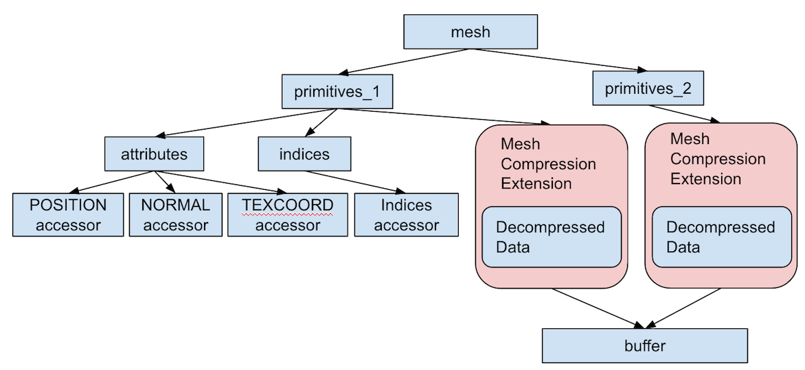

# KHR_draco_mesh_compression

## Contributors

* Fan Zhang, Google, <mailto:zhafang@google.com>
* Ondrej Stava, Google, <mailto:ostava@google.com>
* Frank Galligan, Google, <mailto:fgalligan@google.com>
* Kai Ninomiya, Google, <mailto:kainino@google.com>
* Patrick Cozzi, Cesium, [@pjcozzi](https://twitter.com/pjcozzi)

## Status

Draft

## Dependencies

Written against the glTF 2.0 spec.

## Overview

This extension defines an schema to use Draco geometry compression libraries in glTF format. This allows glTF to support streaming compressed geometry data instead of the raw data.

The [conformance](#conformance) section specifies what an implementation must to do when encountering this extension, and how the extension interacts with the attributes defined in the base specification.

## glTF Schema Updates

Draco geometry compression library could be used for `primitive` by adding an `extension` property to a primitive, and defining its `KHR_draco_mesh_compression` property.

The following picture shows the structure of the schema update. 

**Figure 1**: Structure of geometry compression extension.


In general, we will use the extension to point to the buffer that contains the compressed data. The major change is that the `accessor` in an extended `primitive` no
longer point to a `bufferView`. Instead, the `attributes` of a primitive will use the decompressed data. This is valid because in glTF 2.0, `bufferView` is not required in `accessor`, although if it is not present or the id is 0, it will be used with `sparse` field to act as a sparse accessor. In this extension, we will ignore the `bufferView` property.

Usage of the extension must be listed in the `extensionUsed` and `extensionsRequired`. 

```javascript
"extensionsUsed" : [
    "KHR_draco_mesh_compression"
]

"extensionsRequired" : [
    "KHR_draco_mesh_compression"
]

```

The extension then could be used like the following, note that all other nodes stay the same
except `primitives`:

```javascript

"mesh" : {
    "primitives" : [
        {
            "attributes" : {
                "POSITION" : 11,
                "NORMAL" : 12,
                "TEXCOORD_0" : 13,
            },
            "indices" : 10,
            "mode" : 4
            "extensions" : {
                "KHR_draco_mesh_compression" : {
                    "bufferView" : 5,
                    "indexCount" : 1000,
                    "vertexCount" : 500,
                    "attributes" : [
                        {
                            "semantic" : "POSITION",
                            "componentType" : 5126,
                            "type" : "VEC3",
                        },
                        {
                            "semantic" : "NORMAL",
                            "componentType" : 5126,
                            "type" : "VEC3",
                        },
                        {
                            "semantic" : "TEXCOORD_0",
                            "componentType" : 5126,
                            "type" : "VEC2",
                        },
                    ],
                    "version" : "0.9.1"
                }
            }
        },
    ]
}

"bufferViews" : [
    // ...
    // bufferView of Id 5
    {
        "buffer" : 10,
        "byteOffset" : 1024,
        "byteLength" : 10000
    }
    // ...
}

```
We will explain each of the property in the following sections.
#### bufferView
The `bufferView` property points to the buffer containing compressed data. The data should be passed to a mesh decoder and decompressed to a
mesh.

#### indexCount, vertexCount
`indexCount` and `vertexCount` are references for verifying the decompression of
mesh.

#### attributes
The decompressed mesh needs to be write to the memory for uploading to the GPU,
including indices and attributes data. `attributes` is used to define the
order of the attributes. For example, if we have the above `attributes`, then we need to write the attributes to a vertex buffer like

     --------------------------------------------------
    |    POSITION    |    NORMAL    |    TEXCOORD_0    |  
     --------------------------------------------------

`componentType` and `type` are duplicated properties in
`accessor` of `attributes`. The purpose of having these in the extension is to
define how to write the decompressed mesh to buffer for uploading to the GPU without
refering to the sibling `attributes` node.

The extension currently doesn't support morph targets, e.g. `targets` is used in
`primitive`. 

#### version
The version of Draco encoder used to compress the mesh. This is used for verifying compatibility of Draco encoder and decoder. With this property, the loader could easily determine if the current decoder supports decoding the data.

#### Restrictions on geometry type
When using this extension, the `mode` of `primitive` could only be one of
`POINTS`, `TRIANGLES` and `TRIANGLE_STRIP` and the mesh data will be decoded accordingly. For example, if `mode` is `POINTS`, then the
decompressed geometry will be a point cloud.

### JSON Schema

For full details on the `KHR_draco_mesh_compression` extension properties, see the schema:

* [extension property](schema/node.KHR_draco_mesh_compression.schema.json) `KHR_draco_mesh_compression` extensions object.

## Conformance

To process this extension, there are some changes need to be made in loading a glTF asset.
* Check `version` property and verify the version of encoder used for the mesh
  is compatible with the current decoder.
* When encountering a `primitive` with the extension the first time, you must process the extension first. Get the data from the pointed `bufferView` in the extension and decompress the data to a geometry of a specific format, e.g. Draco geometry.
* Write the indices and vertex data of the mesh to separate buffers. This allows for uploading data with different target including ARRAY_BUFFER and ELEMENT_ARRAY_BUFFER. When writing attributes to a buffer, the order should follow property `attributes` as discribed above.
* Then, process `attributes` and `indices` properties of the `primitive`. When handling `accessor`, insteading of getting data from the regular `bufferView --> buffer`, get the data from the buffers created in previous step.

It is pretty straigtforward for top-down loading of a glTF asset, e.g. only
decompress the geometry data when a `primitive` is met for the first time. However, for
bottom-up loading, loading `accessor` before `primitive` will not get the data. It could only be handled when processing its parent `primitive`. This is based on the consideration that it will rarely happen that
loading an `accessor` without knowing its parent `primitive`. And it should be
easy enought to change the loader to ignore `accessor` without `bufferView` in glTF 2.0. But we are
definitely open to change this if there actually is some use cases that require
loading `accessor` independently. 

## Resources

* [Draco Open Source Library](https://github.com/google/draco)
* [ThreeJS
  Loader](https://github.com/mrdoob/three.js/blob/dev/examples/js/loaders/DRACOLoader.js)
  and
  [example](https://github.com/mrdoob/three.js/blob/dev/examples/webgl_loader_draco.html)


# Appendix: Alternative Approach

See [ALTERNATIVE.md](ALTERNATIVE.md).
